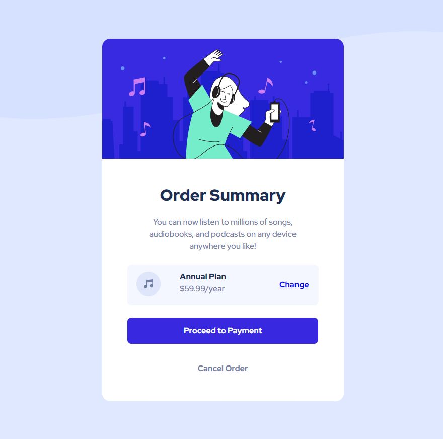

# Frontend Mentor - Order summary card solution

This is a solution to the [Order summary card challenge on Frontend Mentor](https://www.frontendmentor.io/challenges/order-summary-component-QlPmajDUj). Frontend Mentor challenges help you improve your coding skills by building realistic projects. 

## Table of contents

- [Overview](#overview)
  - [The challenge](#the-challenge)
  - [Screenshot](#screenshot)
  - [Links](#links)
- [My process](#my-process)
  - [Built with](#built-with)
- [Author](#author)

## Overview

### The challenge

Users should be able to:

- See hover states for interactive elements

### Screenshot

### Links

- Solution URL: [Add solution URL here](https://your-solution-url.com)
- Live Site URL: [https://mv805.github.io/order-summary-component-main/](https://mv805.github.io/order-summary-component-main/)

## My process

This summary menu was accomplished with a flexbox layout and media query elements to make proper adjustments when the screen is resized to mobile.

### Built with

- HTML5
- CSS custom properties
- Flexbox

## Author

- Website - [Matt V.](https://mv805.github.io)
- Frontend Mentor - [@mv805](https://www.frontendmentor.io/profile/mv805)
